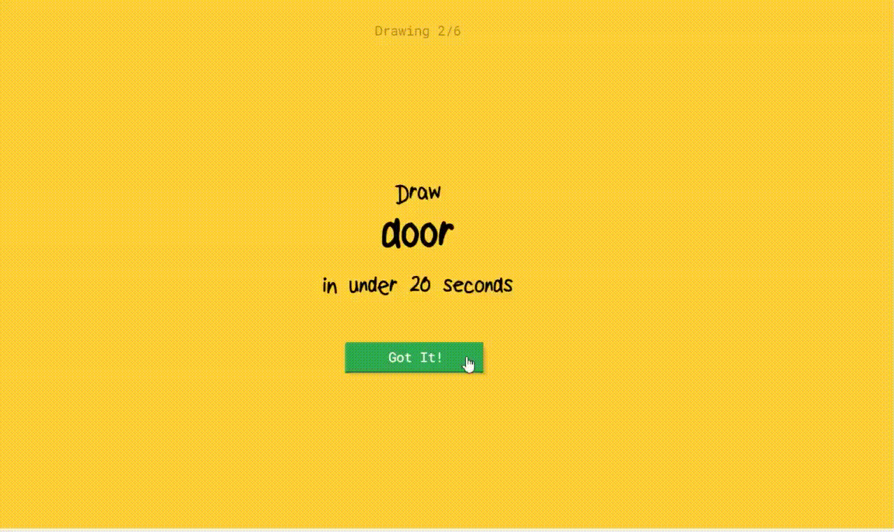
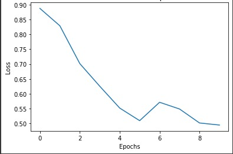
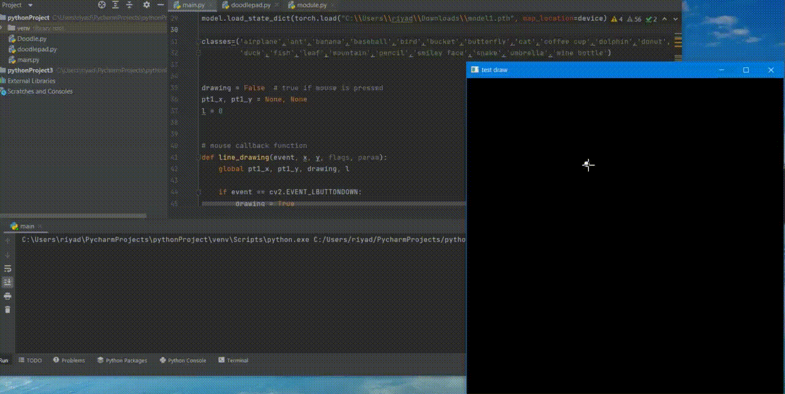

<h1> Doodle Classifier </h1>

**This is a real time doodle classifier that asks the user to draw a picture of an object taken from the 20 classes defined in its database, then uses the concept of Convolutional Neural Networks and Deep Learning to guess the drawing. Similar to Quick, Draw! by Google:**

<h1> Dataset </h1>

**The dataset consisted of 2807037 total images of size 28x28 which were grouped into 20 classes, out of which, 2045200 images were used for training and 761837 for testing.**
**Dataset link: https://drive.google.com/drive/folders/1Xep-ZNaoArr-rfSKiyqZzURDufMZxJmM?usp=sharing** 

<h1> Libraries </h1>

1. Matplotlib- used for plotting graph of cost vs epochs and displaying images of dataset
2. Numpy- used to represent images as arrays (pixel by pixel), and to perform matrix operations 
3. OpenCV- used for making the virtual drawing pad
4. Pytorch- library used for Machine Learning applications using GPUs and CPUs, has automatic differentiation and other functions used in this project which makes the code cleaner and easy to implement.

<h1> Approach </h1>

1. At first, we learned the **basic concepts of Machine Learning** like weights, biases, logistic regression, forword & back prop, gradient descent, vectorization and mini-batches.

2. Then we developed a **Digit Classifier using MNIST** dataset by writing the code to all functions like initialising parameters, forward and backward prop, computing derivatives, activation functions, one hot vector and upgrading parameters. We experimented with the hyperparameters to check which one gives better accuracy.

3. We learned about convolution of images with filters, concept of stride, maxpooling and padding. After multiple convolutional layers, the input representation is flattened into a feature vector and passed through a network of neurons to predict the output probabilities. Coding **CNN using PyTorch on Doodle-Classifier dataset** helped understand these concepts better.

4. A **Drawing Pad** of 600x600 and pen of thickness 9 is also created for the user to doodle on, utilizing the mouse events available in OpenCV. This image is then resized to 28x28 and passed to the trained CNN model for classification.

# Resources used:
- [Coursera Deep Learning](https://www.coursera.org/specializations/deep-learning)
- [Pytorch documentation](https://pytorch.org/docs/stable/index.html)

# **CNN Model**
## **Architecture**

***Convolution Layer***

| Layers   | Kernel size | Filters | Maxpool | Padding|
| -------- | --------    | ------- | ------- | ------ |
| conv1    | (5,5) | 6 | (2,2)   | 0      |
| conv2    | (5,5)       | 16       | (2,2)   | 0      |

***Fully Connected Layer***

| Layer | Size |
| -------- | -------- | 
| FC1    | 16x4x4, 120 | 
| FC1    | 120, 84| 
| FC1    | 84, 20     | 

***Hyperparameters***
| Parameter | Value |
| ---- | --- |
| Learning rate | 0.01 |
| Epochs | 10 |
|  Batch Size | 4096 | 
| Optimizer| SGD |
| Loss function | Cross Entropy Loss

# **Results**

| Dataset | Accuracy |
| ---- |---- |
| Train| 85.54% |
| Test | 85.36% |

## **Final outcome of the model**

